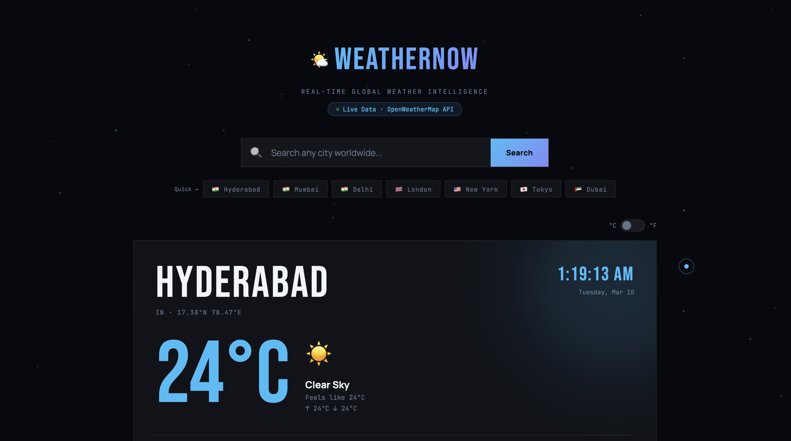

# 🌤 WeatherNow — Live Weather Forecast App

A real-time weather forecast web application that displays current conditions, hourly forecasts, 5-day forecasts, air quality index, and UV index for any city worldwide.

## 🚀 Live Demo

[View Live →](https://weather-app-blush-sigma-71.vercel.app/)

## 📸 Preview



## ✨ Features

- 🔍 **Search any city** worldwide with instant results
- 🌡 **Real-time temperature** with °C / °F toggle
- ⏱ **Live local clock** that ticks in real time for the searched city
- 🌅 **Animated sun arc** showing current sun position
- 💧 **Humidity, wind, visibility, pressure** stats
- 🌿 **Air Quality Index (AQI)** with PM2.5 data
- ☀️ **UV Index** with safety recommendations
- 🕐 **24-hour hourly forecast** with rain probability
- 📅 **5-day forecast** with weather icons
- 🌡 **Temperature color coding** (red = hot, blue = cold)
- ✨ **Animated particle background**
- 📱 **Fully responsive** for mobile and desktop

## 🛠 Tech Stack

| Technology | Purpose |
|---|---|
| HTML5 | Structure |
| CSS3 | Styling & Animations |
| JavaScript (ES6+) | Logic & Interactivity |
| OpenWeatherMap API | Weather Data |

## 📁 Project Structure

```
weather-app/
├── index.html          # Main HTML entry point
├── css/
│   └── style.css       # All styles and animations
├── js/
│   ├── config.js       # API configuration & constants
│   ├── utils.js        # Helper/utility functions
│   ├── weather.js      # API fetching module
│   ├── ui.js           # UI rendering module
│   └── app.js          # Main app controller
└── assets/
    └── preview.png     # App screenshot
```

## ⚙️ Setup & Run Locally

```bash
# 1. Clone the repository
git clone https://github.com/shanmukjavvadi/weather-app.git

# 2. Open the project
cd weather-app

# 3. Open in browser
open index.html
# OR use Live Server in VS Code
```

> **Note:** The app uses a free OpenWeatherMap API key. For production use, replace the key in `js/config.js` with your own from [openweathermap.org](https://openweathermap.org/api).

## 🌐 API Used

- [OpenWeatherMap Current Weather API](https://openweathermap.org/current)
- [OpenWeatherMap 5-Day Forecast API](https://openweathermap.org/forecast5)
- [OpenWeatherMap Air Pollution API](https://openweathermap.org/api/air-pollution)

## 📱 Responsive Design

| Device | Support |
|---|---|
| Desktop | ✅ Full layout |
| Tablet | ✅ Adapted grid |
| Mobile | ✅ Stacked layout |

## 🔮 Future Improvements

- [ ] Add geolocation support (auto-detect user city)
- [ ] Save favourite cities
- [ ] Dark/light theme toggle
- [ ] Precipitation map integration
- [ ] Push notifications for weather alerts

## 👨‍💻 Author

**Javvadi Shanmuk Sai Vardhan**
- GitHub: [@shanmukjavvadi](https://github.com/shanmukjavvadi)
- LinkedIn: [shanmuk-javvadi](https://linkedin.com/in/shanmuk-javvadi)
- Email: shanmukjavvadi@gmail.com

## 📄 License

This project is open source and available under the [MIT License](LICENSE).
